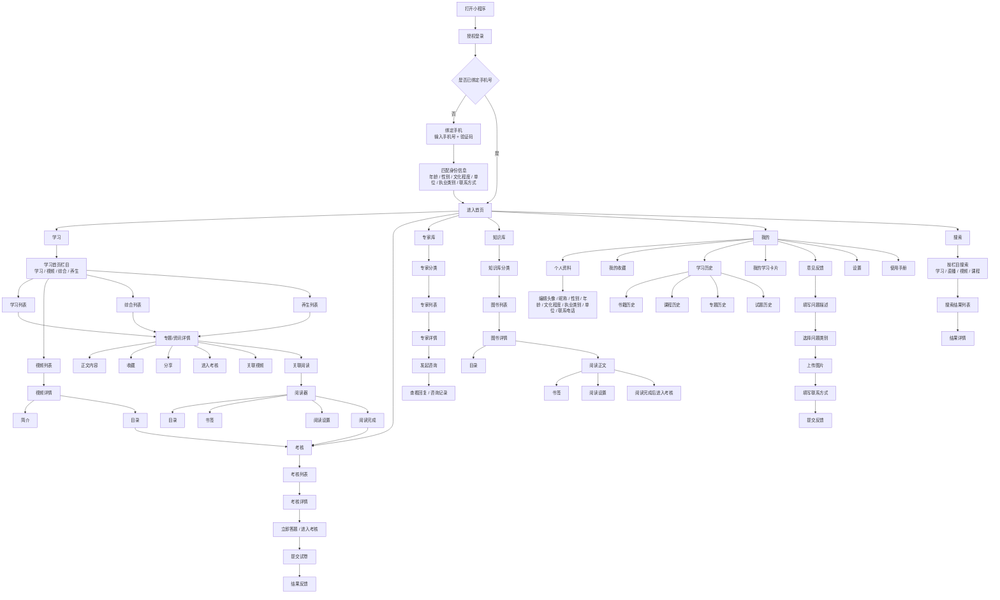

# 中医在线小程序全流程图

## 说明

- 底部一级导航以效果图为准，共 5 个模块：`学习`、`考核`、`专家库`、`知识库`、`我的`。
- `搜索` 更适合作为学习域内的功能入口，而不是底部一级导航。
- `咨询` 不建议与 `专家库` 并列作为同级底部导航。更合理的关系是：`专家库 -> 专家详情 -> 发起咨询 / 咨询记录`。
- `我的` 模块按当前设计应包含：`个人资料`、`我的收藏`、`学习历史`、`我的学习卡片`、`意见反馈`、`设置`、`使用手册`。
- 学习详情页是聚合节点，可继续进入 `视频`、`阅读` 和 `考核`。
